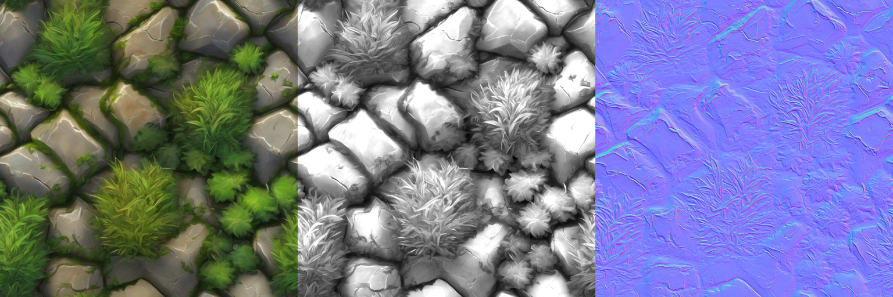
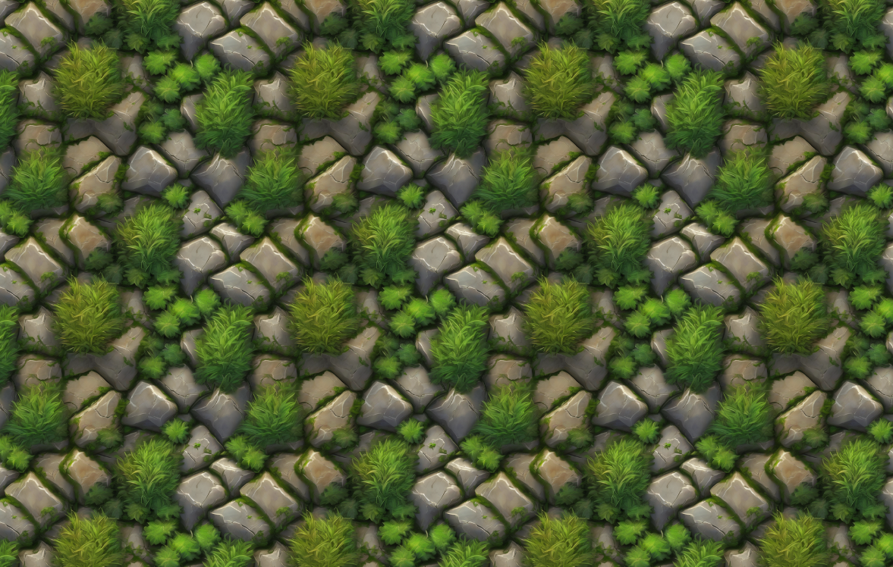

# Prompt2Material
<h1 align="center">Prompt2Material</h1>
Leveraging stable diffusion XL to generate seamless textures from a single prompt

**Prompt : "League of legends style realistic pbr grassy stone tiles texture topview seamless perfect"**

# Requirements

**The specific versions of the packages are not particularly important. Skip this steps if all the packages are installed**

If using python :

<pre>python -m pip show diffusers     || python -m pip install diffusers
python -m pip show torch         || python -m pip install torch
python -m pip show opencv-python || python -m pip install opencv-python
python -m pip show Flask         || python -m pip install Flask
python -m pip show Pillow        || python -m pip install Pillow
python -m pip show numpy         || python -m pip install numpy
</pre>

Or python3 : 

<pre>python3 -m pip show diffusers     || python3 -m pip install diffusers
python3 -m pip show torch         || python3 -m pip install torch
python3 -m pip show opencv-python || python3 -m pip install opencv-python
python3 -m pip show Flask         || python3 -m pip install Flask
python3 -m pip show Pillow        || python3 -m pip install Pillow
python3 -m pip show numpy         || python3 -m pip install numpy</pre>

# Usage
 ``./generate_material.sh --prompt "Your texture prompt here"``

  ``./generate_material.sh --prompt "Your texture prompt here" --view_results`` To see generate material

  Texture, normal map and displacement (extrusion) map are saved in ``results/``.
  
# Prompt Tips
Texture generation works best with tags like 'seamless', 'pbr', 'texture', 'topview'

# Flask full web-UI
Coming soon
